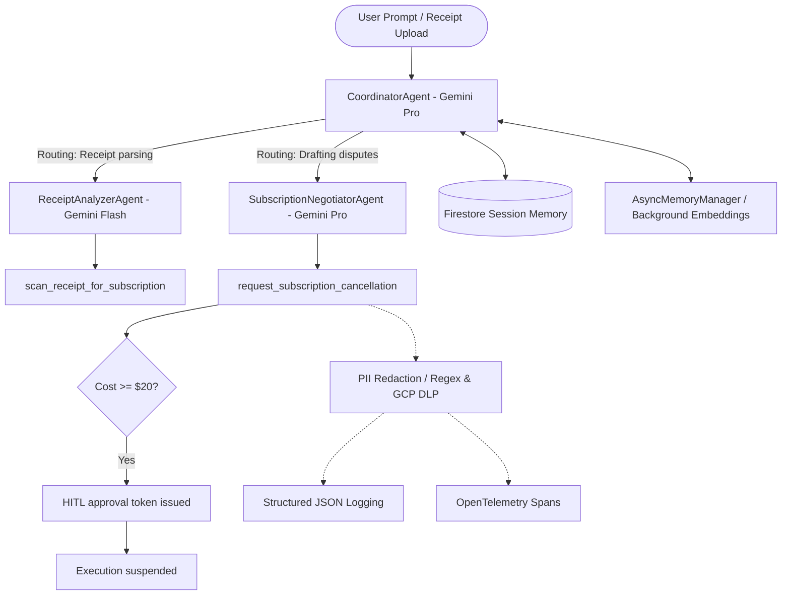

# FinSentry: Autonomous Subscription & Expense Concierge Agent

FinSentry is a secure, autonomous concierge agent designed to monitor personal subscriptions, analyze receipts, draft expense disputes, and handle provider cancellations safely.

---

## 🏗️ System Architecture & Workflow

The diagram below details the multi-agent orchestration, tools layout, logging infrastructure, and safety/human-in-the-loop loops.



---

## 🚀 Running the Project

### Prerequisite Setup
1. Clone this repository locally (if not already done).
2. Install the package dependencies:
   ```bash
   pip install -r requirements.txt
   ```
3. Set your Google Cloud credentials (if integrating with Secret Manager or Firestore):
   ```bash
   export GOOGLE_APPLICATION_CREDENTIALS="/path/to/your/service-account.json"
   export GOOGLE_CLOUD_PROJECT="your-gcp-project-id"
   ```
   *Note: If no GCP project credentials are configured, the codebase degrades gracefully, reading configuration keys from local environment variables and writing database entries to a local JSON file (`data/session_store.json`).*

### ☁️ Programmatic Provisioning & Deployment (IaC + Agent CLI)
To provision resources (Firestore database, Secret Manager secrets, and service account IAM bindings) via Terraform and deploy the agent to GCP Cloud Run using the **ADK CLI**, execute the following command:
```bash
./deploy.sh
```

### Running Automated Evaluations
Run the test suite (golden dataset regression checks, HITL validations, PII redactors, memory compactions):
```bash
pytest tests/test_eval.py -v
```

### Running the Agent Code (Mock Example)
Create a quick script `run_mock_agent.py` inside the root directory to interact with the agent:
```python
import asyncio
from finsentry.agent import CoordinatorAgent

async def main():
    agent = CoordinatorAgent(session_id="developer-test-session")
    
    # 1. Parse a receipt
    print("--- 1. Parsing Receipt ---")
    resp1 = await agent.run("Please analyze receipt: Spotify monthly subscription costs $14.99")
    print(f"Agent Response:\n{resp1}\n")

    # 2. Cancel Adobe subscription (triggers Human-In-The-Loop approval warning)
    print("--- 2. High-Stakes Cancellation ---")
    resp2 = await agent.run("Please cancel my subscription for Adobe Creative Cloud.")
    print(f"Agent Response:\n{resp2}\n")

if __name__ == "__main__":
    asyncio.run(main())
```

Execute it:
```bash
python run_mock_agent.py
```
